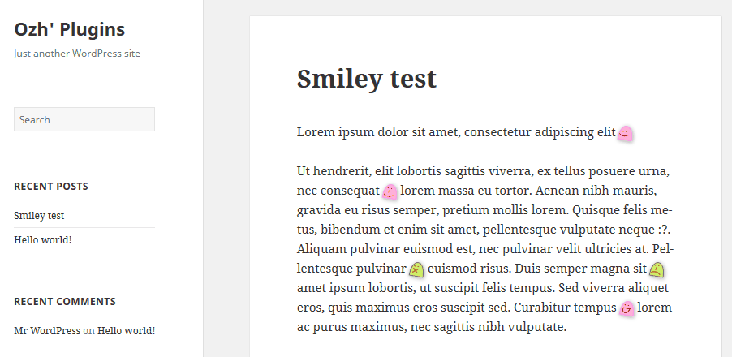

# Ozh' CSS Smilies for WordPress

WordPress smilies are hideous, right? This plugin replaces your hand typed smiley (eg `:-)`) with a pure HTML markup that is then easy to style.

Read the blog post for details: [Revisiting WordPress smilies in a pure CSS way](http://planetozh.com/blog/2014/12/revisiting-wordpress-smilies-in-a-pure-css-way/)

This plugin adds ~~super annoying~~ super cute CSS3 animated little ghosts.

It is meant to be a start for your hacking and theming needs. Modify the CSS and make something gorgeous that matches your theme.

